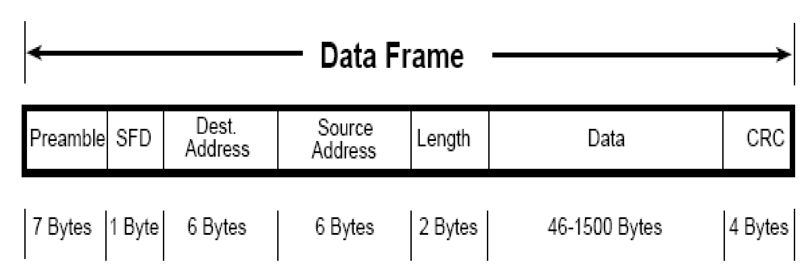

# Ethernet

- Ethernet là một công nghệ mạng phổ biến được sử dụng rộng rãi trong các mạng máy tính và mạng LAN (Local Area Network).

- Nó hoạt động ở lớp 1 và lớp 2 trong mô hình OSI.

## Một số thông tin cơ bản về Ethernet

1. Mục đích: 

- Ethernet được thiết kế để kết nối các thiết bị mạng trong một mạng LAN và cho phép chúng truyền dữ liệu với nhau thông qua cáp mạng.

2. Đặc điểm chính:

- Truyền thông CSMA/CD: Ethernet sử dụng phương pháp truyền thông CSMA/CD (Carrier Sense Multiple Access with Collision Detection) để kiểm soát truy cập vào mạng. Kỹ thuật này cho phép nhiều thiết bị cùng truy cập vào mạng và phát hiện và xử lý xung đột dữ liệu.

- Các loại cáp: Có nhiều loại cáp Ethernet được sử dụng, bao gồm cáp đồng trục (coaxial), cáp xoắn đôi (twisted pair) và cáp quang (fiber optic). Cáp xoắn đôi (như cáp Cat5e, Cat6, Cat6a) và cáp quang (như cáp Single-mode và Multi-mode) là hai loại phổ biến nhất hiện nay.

- Tốc độ truyền dẫn: Ethernet hỗ trợ nhiều tốc độ truyền dẫn dữ liệu khác nhau, từ 10 Mbps (Ethernet cổ điển) đến hàng trăm Gbps (Ethernet Gigabit và Ethernet 10 Gigabit).

- Địa chỉ MAC: Mỗi thiết bị kết nối vào mạng Ethernet được gán một địa chỉ MAC (Media Access Control), đây là một địa chỉ duy nhất để xác định thiết bị đó trong mạng.

3. Cấu trúc gói tin Ethernet
Gói tin Ethernet bao gồm các trường sau:

- `Địa chỉ MAC nguồn và đích`: Địa chỉ MAC của thiết bị gửi và thiết bị nhận.

- `Loại hoặc chiều dài`: Trường này chỉ định loại dữ liệu hoặc độ dài của trường dữ liệu.

- `Trường dữ liệu (Data)`: Dữ liệu cần truyền đi.

- `Checksum (FCS)`: Trường kiểm tra lỗi cho gói tin.

- `Giao thức Ethernet`: Các tiêu chuẩn và giao thức liên quan đến Ethernet được quản lý và phát triển bởi IEEE (Institute of Electrical and Electronics Engineers). Các tiêu chuẩn Ethernet phổ biến bao gồm Ethernet 802.3, Fast Ethernet (802.3u), Gigabit Ethernet (802.3ab), và 10 Gigabit Ethernet (802.3ae).

4. Ethernet là một trong những công nghệ mạng phổ biến nhất và quan trọng trong ngành công nghiệp mạng, và nó được sử dụng rộng rãi trong nhiều môi trường kinh doanh và cá nhân.

## LLC (Logical Link Control)

- LLC là một phần của lớp đỉnh của Ethernet, được xác định bởi tiêu chuẩn IEEE 802.2; LLC là một phần quan trọng của Ethernet vì nó cung cấp các chức năng điều khiển liên kết logic và quản lý truy cập vào môi trường truyền thông.

- `Chức năng`: LLC thực hiện các chức năng điều khiển liên kết logic, bao gồm xác định địa chỉ, kiểm soát lỗi, phân đoạn dữ liệu, quản lý luồng dữ liệu và kiểm soát truy cập vào môi trường truyền thông.

- `Địa chỉ MAC`: LLC sử dụng địa chỉ MAC (Media Access Control) để xác định các máy tính và thiết bị trong mạng Ethernet. Địa chỉ MAC được sử dụng để xác định điểm đầu cuối của mỗi gói dữ liệu trên mạng.

- `Truy cập vào môi trường truyền thông`: LLC quản lý truy cập vào môi trường truyền thông, đảm bảo rằng các gói dữ liệu được truyền đi một cách an toàn và hiệu quả. Nó sử dụng các giao thức và thuật toán như CSMA/CD (Carrier Sense Multiple Access with Collision Detection) để quản lý truy cập vào môi trường truyền thông trong mạng Ethernet.

- `IEEE 802.2`: LLC là một phần của tiêu chuẩn IEEE 802.2, được xác định trong các tiêu chuẩn Ethernet và Token Ring. Cụ thể, nó quản lý các kết nối với lớp mạng trên một giao diện vật lý Ethernet.

## MAC (Media Access Control)

- Trong Ethernet, địa chỉ MAC là một địa chỉ duy nhất được gán cho mỗi giao diện mạng, như là một thiết bị mạng hoặc một card mạng trên máy tính. Địa chỉ MAC được sử dụng để xác định điểm đầu cuối của mỗi gói dữ liệu trên mạng và đảm bảo rằng nó được gửi đến đúng đích.

- `Định dạng`: Địa chỉ MAC được biểu diễn dưới dạng một chuỗi của 6 byte (48 bit), thường được viết dưới dạng sáu cặp số hexa, được phân tách bởi dấu hai chấm. Ví dụ: 00:1A:2B:3C:4D:5E.

- `Duỗi MAC`: Mỗi card mạng Ethernet trên mạng có một địa chỉ MAC duy nhất, không trùng lặp. Địa chỉ MAC này thường được ghi vào bộ nhớ ROM của card mạng và không thay đổi trong quá trình sử dụng.

- `Xác định gói dữ liệu`: Khi một gói dữ liệu được gửi trên mạng Ethernet, nó bao gồm địa chỉ MAC nguồn và địa chỉ MAC đích. Địa chỉ MAC nguồn là địa chỉ của máy gửi, trong khi địa chỉ MAC đích là địa chỉ của máy nhận. Các thiết bị mạng sử dụng địa chỉ MAC để xác định xem gói dữ liệu nào nên được chấp nhận và xử lý.

- `Giao thức CSMA/CD`: Để quản lý truy cập vào môi trường truyền thông, Ethernet thường sử dụng giao thức CSMA/CD (Carrier Sense Multiple Access with Collision Detection). Giao thức này cho phép các thiết bị mạng nghe trạng thái của môi trường truyền thông và kiểm tra xem có xung đột dữ liệu nào xảy ra hay không.

- `Dải địa chỉ`: Các dải địa chỉ MAC được quản lý bởi IEEE. Một số dải địa chỉ được dành riêng cho các nhà sản xuất thiết bị mạng, trong khi một số khác được sử dụng cho mục đích cụ thể như định danh địa chỉ MAC ngẫu nhiên.

