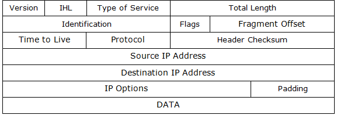

# IP-v4

## Khái niệm

- IPv4 (Internet Protocol version 4) là phiên bản gốc và phổ biến nhất của giao thức Internet Protocol (IP). IPv4 sử dụng một địa chỉ IP 32-bit, chia thành 4 octet, mỗi octet được biểu diễn bằng một số từ 0 đến 255 và được ngăn cách bởi dấu chấm. Ví dụ: 192.168.1.1

## Đặc điểm

1. `Địa chỉ IP`: Địa chỉ IP là một số duy nhất được gán cho mỗi thiết bị trong mạng để xác định và định vị nó trong mạng Internet hoặc mạng nội bộ. Địa chỉ IPv4 được chia thành hai phần: phần network và phần host.

2. `Subnetting`: IPv4 cho phép mạng được chia thành các phân mạng nhỏ hơn, gọi là subnet. Điều này giúp tối ưu hóa việc sử dụng địa chỉ IP bằng cách phân chia mạng lớn thành các mạng nhỏ hơn có kích thước phù hợp với nhu cầu cụ thể của mạng.

3. `Classful và Classless IP Addressing`: IPv4 trước đây được chia thành các lớp (Classful addressing) như Class A, B, C, D và E. Tuy nhiên, hiện nay thường sử dụng Classless Inter-Domain Routing (CIDR) để phân chia địa chỉ IP một cách linh hoạt hơn.

4. `Private IP Addresses`: IPv4 cũng định nghĩa một số dải địa chỉ IP được dành riêng cho việc sử dụng trong mạng nội bộ (private networks). Các dải địa chỉ này không được định tuyến qua Internet và được sử dụng cho các thiết bị trong mạng nội bộ mà không cần địa chỉ IP công cộng.

5. `IPv4 Address Exhaustion`: Một vấn đề lớn của IPv4 là cạn kiệt địa chỉ IP. Do số lượng địa chỉ IP có hạn, và với sự phát triển nhanh chóng của Internet và số lượng thiết bị kết nối, dần dần địa chỉ IPv4 trở nên khan hiếm. Điều này đã dẫn đến việc phát triển IPv6, phiên bản mới của giao thức IP với địa chỉ dài hơn và dung lượng địa chỉ lớn hơn để giải quyết vấn đề này.

## Cấu trúc gói tin IP-v4



1. Header(phần đầu)

- `Version (Phiên bản)`: Đây là 4 bit đầu tiên của header và xác định phiên bản của giao thức IP. Trong IPv4, giá trị của trường này là 4.

- `Header Length (Độ dài header)`: Đây là trường 4 bit tiếp theo và xác định kích thước của header IPv4, tính bằng số lượng 32-bit word (từ) trong header. Giá trị của trường này thường từ 5 đến 15, biểu thị từ 20 đến 60 byte.

- `Type of Service (Loại dịch vụ)`: Trường này 8 bit và được sử dụng để xác định các yêu cầu về chất lượng dịch vụ (Quality of Service - QoS) và ưu tiên của gói tin.

- `Total Length (Tổng độ dài)`: Đây là trường 16 bit và xác định tổng kích thước của gói tin IPv4, bao gồm cả header và dữ liệu, tính bằng byte.

- `Identification`: Đây là trường 16 bit xác định một gói tin cụ thể trong một luồng dữ liệu.

- `Flags`: Trường này bao gồm 3 bit, được sử dụng để kiểm soát và quản lý việc chia nhỏ gói tin (fragmentation).

- `Fragment Offset`: Đây là trường 13 bit và xác định vị trí của các fragment (mảnh) trong gói tin ban đầu.

- `Time to Live (TTL)`: Đây là trường 8 bit xác định số lượng máy chủ mạng (router) mà gói tin có thể đi qua trước khi bị hủy bỏ.

- `Protocol`: Trường này 8 bit xác định giao thức tiếp theo được sử dụng trong dữ liệu payload của gói tin, ví dụ như TCP, UDP, hoặc ICMP.

- `Header Checksum`: Trường này 16 bit được sử dụng để kiểm tra tính toàn vẹn của header IPv4.

- `Source IP Address (Địa chỉ IP nguồn)`: Trường này là 32 bit và xác định địa chỉ IP của nguồn gửi gói tin.

- `Destination IP Address (Địa chỉ IP đích)`: Trường này là 32 bit và xác định địa chỉ IP của đích nhận gói tin.

2. DATA(dữ liệu)

- Phần này chứa dữ liệu thực sự của gói tin, có thể là thông điệp của các giao thức như TCP hoặc UDP.

## Địa chỉ IPv4

- Địa chỉ IPv4 là một địa chỉ duy nhất được gán cho mỗi thiết bị trong mạng IPv4 để xác định và định vị nó trong mạng. Địa chỉ này thường được biểu diễn dưới dạng một chuỗi số, chia thành 4 octet (từ), mỗi octet được biểu diễn bằng một số từ 0 đến 255 và được ngăn cách bởi dấu chấm.

- Ví dụ: 192.168.1.1

> Trong đó:
```sh
	192 là giá trị của octet đầu tiên.
	168 là giá trị của octet thứ hai.
	1 là giá trị của octet thứ ba.
	1 là giá trị của octet thứ tư.
```

- `Phạm vi của địa chỉ IPv4`: Địa chỉ IPv4 nằm trong phạm vi từ 0.0.0.0 đến 255.255.255.255

- `Dải địa chỉ IP công cộng và dải địa chỉ IP riêng tư`: IPv4 chia thành các dải địa chỉ IP công cộng và riêng tư. Các dải địa chỉ IP công cộng được sử dụng để định danh các thiết bị trên Internet, trong khi các dải địa chỉ IP riêng tư được sử dụng trong các mạng nội bộ.

- `Lớp địa chỉ IPv4`: Trước đây, IPv4 được chia thành các lớp (Classful addressing) như Class A, B, C, D và E. Tuy nhiên, hiện nay thường sử dụng Classless Inter-Domain Routing (CIDR) để phân chia địa chỉ IP một cách linh hoạt hơn.

- `Khuyết định địa chỉ IPv4`: Địa chỉ IP có thể được sử dụng trong dạng khuyết định, trong đó một hoặc nhiều octet cuối cùng của địa chỉ được thay thế bằng một dấu * để đại diện cho một dải địa chỉ.

## Phân lớp địa chỉ IPv4

- Trước khi CIDR (Classless Inter-Domain Routing) được áp dụng rộng rãi, IPv4 được chia thành các lớp (Classful addressing). Có tổng cộng 5 lớp IPv4: A, B, C, D và E. Mỗi lớp được sử dụng cho một mục đích cụ thể và có các đặc điểm riêng. Dưới đây là các lớp IPv4 cùng với phạm vi và đặc điểm chính:

1. `Lớp A`

- Phạm vi địa chỉ: 0.0.0.0 đến 127.255.255.255
- Địa chỉ đầu tiên: 0.0.0.0
- Địa chỉ cuối cùng: 127.255.255.255
- Số lượng mạng: 2^7 = 128
- Số lượng địa chỉ IP trong mỗi mạng: 2^24 - 2 = 16,777,214 (do hai địa chỉ đầu và cuối của mỗi mạng được dành cho địa chỉ mạng và broadcast)

2. `Lớp B`

- Phạm vi địa chỉ: 128.0.0.0 đến 191.255.255.255
- Địa chỉ đầu tiên: 128.0.0.0
- Địa chỉ cuối cùng: 191.255.255.255
- Số lượng mạng: 2^14 = 16,384
- Số lượng địa chỉ IP trong mỗi mạng: 2^16 - 2 = 65,534

3. `Lớp C`

- Phạm vi địa chỉ: 192.0.0.0 đến 223.255.255.255
- Địa chỉ đầu tiên: 192.0.0.0
- Địa chỉ cuối cùng: 223.255.255.255
- Số lượng mạng: 2^21 = 2,097,152
- Số lượng địa chỉ IP trong mỗi mạng: 2^8 - 2 = 254

4. `Lớp D(Muticast)`

- Phạm vi địa chỉ: 224.0.0.0 đến 239.255.255.255
- Địa chỉ này được sử dụng cho giao thức Multicast để gửi dữ liệu từ một nguồn đến nhiều đích.

5. `Lớp E(Reserved)`

- Phạm vi địa chỉ: 240.0.0.0 đến 255.255.255.255
- Lớp này được dành cho mục đích thử nghiệm và các nghiên cứu tương lai.

==> Lớp A, B và C là những lớp chính thường được sử dụng trong các mạng công cộng và mạng doanh nghiệp. Lớp D được sử dụng cho Multicast, trong khi lớp E được dành cho các mục đích đặc biệt và các dự án nghiên cứu.

