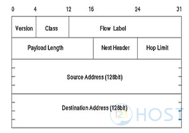

# IP-v6

## Khái niệm

- IPv6 (Internet Protocol version 6) là một phiên bản mới của giao thức Internet Protocol (IP), được thiết kế để thay thế IPv4 do sự cạn kiệt của địa chỉ IPv4. IPv6 sử dụng một địa chỉ 128-bit, so với IPv4 chỉ sử dụng địa chỉ 32-bit, nâng cao sự linh hoạt và dung lượng địa chỉ.

## Đặc điểm

- `Địa chỉ IPv6`: Địa chỉ IPv6 là một chuỗi 128-bit, thường được biểu diễn dưới dạng hexadecimal và được phân chia thành 8 nhóm, mỗi nhóm là 16 bit và được ngăn cách bởi dấu hai chấm. Ví dụ: 2001:0db8:85a3:0000:0000:8a2e:0370:7334.

- `Phạm vi địa chỉ IPv6`: Địa chỉ IPv6 có dung lượng lớn hơn nhiều so với IPv4, cho phép hỗ trợ số lượng địa chỉ lớn hơn và giảm nguy cơ cạn kiệt địa chỉ IP. IPv6 có hỗ trợ cho khoảng 3,4 × 10^38 địa chỉ IP duy nhất.

- `Khả năng tăng cường bảo mật`: IPv6 bao gồm các tính năng bảo mật tích hợp như IPSec (Internet Protocol Security), giúp tăng cường bảo mật cho các kết nối mạng.

- `Autoconfiguration`: IPv6 hỗ trợ cấu hình tự động cho các thiết bị trong mạng, giúp giảm thiểu công việc quản trị mạng.

- `Routing và Multicast`: IPv6 cung cấp các cải tiến trong việc định tuyến và Multicast, giúp cải thiện hiệu suất của mạng.

- `Tích hợp ngược dạng IPv4`: IPv6 có thể tích hợp với IPv4, cho phép tự động chuyển đổi giữa hai loại địa chỉ IP và hỗ trợ các ứng dụng sử dụng IPv4 và IPv6 đồng thời.

--> Mặc dù IPv6 đã được ra mắt từ lâu, nhưng sự triển khai của IPv6 vẫn diễn ra chậm rãi do sự phổ biến của IPv4. Tuy nhiên, với sự cạn kiệt ngày càng tăng của địa chỉ IPv4, việc triển khai IPv6 trở nên ngày càng cần thiết.

## Cấu trúc gói tin IPv6



1. Header (Phần đầu) IPv6

- `Version (Phiên bản)`: Đây là 4 bit đầu tiên của header và xác định phiên bản của giao thức IP. Trong IPv6, giá trị của trường này là 6.

- `Traffic Class`: Trường này có 8 bit và được sử dụng để xác định ưu tiên hoặc loại dịch vụ của gói tin. Cũng giống như trường Type of Service (ToS) trong IPv4.

- `Flow Label`: Trường này có 20 bit và được sử dụng để đánh dấu các gói tin cùng một lưu lượng dữ liệu hoặc các luồng dữ liệu liên quan.

- `Payload Length (Độ dài tải)`: Đây là trường 16 bit xác định kích thước của phần dữ liệu payload, tính bằng byte.

- `Next Header`: Trường này có 8 bit và xác định giao thức tiếp theo trong phần dữ liệu payload của gói tin, ví dụ như TCP, UDP hoặc ICMPv6.

- `Hop Limit (Hạn chế số bước nhảy)`: Trường này có 8 bit và xác định số lượng bước nhảy tối đa mà gói tin có thể đi qua trước khi bị hủy bỏ (giống như Time to Live - TTL trong IPv4).

- `Source Address (Địa chỉ nguồn)`: Trường này là 128 bit và xác định địa chỉ IP của nguồn gửi gói tin.

- `Destination Address (Địa chỉ đích)`: Trường này là 128 bit và xác định địa chỉ IP của đích nhận gói tin.

2. Data (Dữ liệu):

- Phần này chứa dữ liệu thực sự của gói tin, có thể là thông điệp của các giao thức như TCP, UDP, hoặc ICMPv6.

## Địa chỉ IPv6

- Địa chỉ IPv6 là một địa chỉ duy nhất được gán cho mỗi thiết bị trong mạng IPv6 để xác định và định vị nó trong mạng. Địa chỉ IPv6 được biểu diễn dưới dạng một chuỗi 128-bit, chia thành 8 nhóm 16-bit, mỗi nhóm được biểu diễn bằng một con số thập lục phân (hexadecimal) và được ngăn cách bằng dấu hai chấm.

- Ví dụ: 
```sh
	2001:0db8:85a3:0000:0000:8a2e:0370:7334
```

> Trong đó: 

		+ Mỗi nhóm 16-bit được biểu diễn bằng 4 chữ số thập lục phân. 

     	+ Các nhóm 16-bit được ngăn cách bằng dấu hai chấm. 
 
- Tuy nhiên, để giảm bớt sự lặp lại của các nhóm 0 liên tiếp, việc gỡ bỏ các nhóm 0 liên tiếp trong mỗi octet và thay thế chúng bằng `dấu hai chấm hai lần (::)` là phổ biến. Điều này chỉ được phép sử dụng một lần trong mỗi địa chỉ IPv6.

- Ví dụ:

```sh
	2001:0db8:85a3::8a2e:0370:7334
```

- Cấu trúc địa chỉ IPv6 cụ thể bao gồm:

	+ `Phần Prefix (Tiền tố)`: Địa chỉ IPv6 thường được chia thành hai phần: tiền tố và địa chỉ liên kết.

	+ `Địa chỉ liên kết`: Đây là phần địa chỉ chính xác của một thiết bị trong mạng. Phần này đại diện cho địa chỉ IPv6 cụ thể của thiết bị trong mạng.

	+ `Phần Zone ID`: Đây là một phần tùy chọn trong địa chỉ IPv6, chỉ ra một giao diện mạng cụ thể trên một thiết bị địa lý có nhiều giao diện.

	+ `Phần Tiền tố`: Phần tiền tố thường chỉ định một phần của địa chỉ IPv6, cho biết loại và quyền hạn của địa chỉ đó, ví dụ như địa chỉ định tuyến (Routing prefix) hoặc địa chỉ đa dạng (Anycast address).

