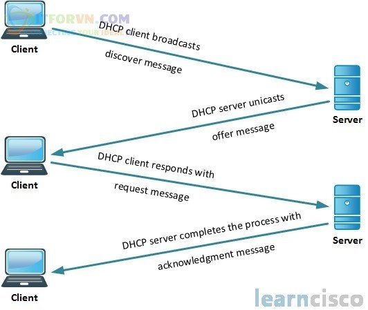

# Dynamic Host Configuration Protocol (DHCP)

## Khái niệm

- Dynamic Host Configuration Protocol (DHCP) là một giao thức mạng được sử dụng để tự động cấu hình các thiết bị mạng, chẳng hạn như máy tính, điện thoại di động, máy in, và các thiết bị khác, để chúng có thể kết nối và hoạt động trên mạng IP một cách dễ dàng.

## Cách hoạt động



1. `Yêu cầu IP`: Khi một thiết bị muốn tham gia vào mạng, nó gửi một yêu cầu IP (DHCP Discover) tới mạng, yêu cầu một địa chỉ IP.

2. `Cung cấp IP`: Một máy chủ DHCP trên mạng nhận được yêu cầu và cung cấp một địa chỉ IP có sẵn cho thiết bị (DHCP Offer).

3. `Yêu cầu IP của thiết bị`: Thiết bị chấp nhận địa chỉ IP bằng cách gửi một yêu cầu xác nhận (DHCP Request) đến máy chủ DHCP.

4. `Xác nhận và cấu hình`: Máy chủ DHCP xác nhận yêu cầu và cấu hình địa chỉ IP cho thiết bị. Nó cũng cung cấp thông tin về các cài đặt mạng khác như địa chỉ IP của cổng gateway, địa chỉ máy chủ DNS, và các cài đặt khác thông qua DHCP Acknowledge.

5. `Tái cấu hình`: Các thiết bị cần phải liên tục cập nhật địa chỉ IP của mình thông qua việc gia hạn thuê bao DHCP. Quá trình này được gọi là tái cấu hình (DHCP Renewal).

## Đặc điểm

1. `Tự động cấu hình`: DHCP tự động cấu hình địa chỉ IP cho các thiết bị mạng, giúp tiết kiệm thời gian và công sức của người quản trị mạng.

2. `Quản lý IP`: DHCP giúp quản lý địa chỉ IP trên mạng bằng cách phân phối chúng theo cách tự động và có tổ chức.

3. `Tiết kiệm địa chỉ IP`: Khi một thiết bị rời khỏi mạng hoặc không còn cần kết nối nữa, địa chỉ IP thuê bao có thể được giải phóng và sử dụng lại cho các thiết bị khác.

4. `Cấu hình linh hoạt`: DHCP không chỉ cấu hình địa chỉ IP mà còn cung cấp các thông tin cấu hình mạng khác như địa chỉ cổng gateway, máy chủ DNS, và các tùy chọn khác.

## Cấu hình

1. Truy cập vào cấu hình thiết bị mạng

- Trước tiên, bạn cần truy cập vào giao diện cấu hình của thiết bị mạng mà bạn muốn cấu hình làm máy chủ DHCP. Điều này có thể là giao diện dòng lệnh (CLI) hoặc giao diện đồ họa của router hoặc máy chủ.

2. Cấu hình dải địa chỉ IP cho DHCP

- Bạn cần chỉ định một dải địa chỉ IP mà máy chủ DHCP sẽ sử dụng để phân phối cho các thiết bị trên mạng. Dải địa chỉ này cần phải nằm trong phạm vi mạng của bạn.

3. Cấu hình các thông số khác của DHCP

- Ngoài địa chỉ IP, bạn cũng có thể cấu hình các thông số khác như địa chỉ cổng gateway, máy chủ DNS, thời gian thuê địa chỉ IP (thời gian thuê bao), và các tùy chọn khác.

4. Kích hoạt dịch vụ DHCP

- Sau khi cấu hình các thông số cần thiết, bạn cần kích hoạt dịch vụ DHCP trên thiết bị của mình để bắt đầu phân phối địa chỉ IP cho các thiết bị trong mạng.

5. Ví dụ

- Cấu hình DHCP trên Router Cisco (CLI)

```sh
	Router(config)# ip dhcp pool LAN
	Router(dhcp-config)# network 192.168.1.0 255.255.255.0
	Router(dhcp-config)# default-router 192.168.1.1
	Router(dhcp-config)# dns-server 8.8.8.8
	Router(dhcp-config)# exit
	Router(config)# interface GigabitEthernet0/0
	Router(config-if)# ip address 192.168.1.1 255.255.255.0
	Router(config-if)# ip helper-address 192.168.1.1
```

- Trong ví dụ trên:

	+ Một DHCP pool được tạo với tên "LAN".

	+ Dải địa chỉ IP là 192.168.1.0/24.

	+ Địa chỉ cổng gateway được cấu hình là 192.168.1.1.

	+ Máy chủ DNS được cấu hình là 8.8.8.8 (Google DNS).

	+ Thời gian thuê địa chỉ IP là 7 ngày.

	+ DHCP được kích hoạt trên cổng kết nối GigabitEthernet0/0.

## Kiểm tra cấu hình

1. Kiểm tra cấu hình DHCP trên một router Cisco 

```sh
	Router# show running-config | include dhcp
```

==> Lệnh này sẽ hiển thị tất cả các dòng trong cấu hình hiện tại của router mà chứa từ "dhcp". Điều này bao gồm cấu hình DHCP pool, IP DHCP Relay, các địa chỉ IP được loại trừ và các cài đặt DHCP khác.

2. Kiểm tra chi tiết về cấu hình của một DHCP pool cụ thể

```sh
	Router# show ip dhcp pool <pool-name>
```

- Thay thế "<pool-name>" bằng tên của DHCP pool mà bạn muốn kiểm tra.
