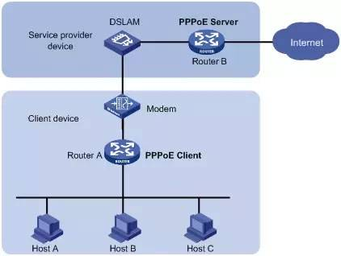

# Point-to-Point Protocol over Ethernet (PPPoE)

## Khái niệm

- PPPoE là viết tắt của "Point-to-Point Protocol over Ethernet", là một phương thức kết nối Internet phổ biến được sử dụng để cung cấp dịch vụ truy cập Internet cho các khách hàng cá nhân và doanh nghiệp thông qua mạng Ethernet. 

- PPPoE kết hợp giữa hai giao thức: PPP (Point-to-Point Protocol) và Ethernet.

## Đặc điểm

- `Point-to-Point Protocol (PPP)`: Là một giao thức điểm-điểm được sử dụng để thiết lập kết nối giữa hai thiết bị (thường là máy tính của người dùng và máy chủ ISP). PPP cung cấp cơ chế xác thực, mã hóa và quản lý kết nối.

- `Ethernet`: Là một công nghệ mạng phổ biến, thường được sử dụng để kết nối các thiết bị trong mạng cục bộ (LAN). Ethernet cung cấp một phương tiện vật lý để truyền dữ liệu giữa các thiết bị.

- `PPPoE Session`: Khi một máy tính hoặc thiết bị muốn kết nối với Internet thông qua PPPoE, nó thiết lập một "PPPoE session" với máy chủ PPPoE của nhà cung cấp dịch vụ Internet (ISP). Trong quá trình này, thông tin xác thực được trao đổi giữa máy tính và máy chủ để xác định danh tính của người dùng và thiết lập kết nối Internet.

- `Authentication`: PPPoE sử dụng các phương thức xác thực như PAP (Password Authentication Protocol) hoặc CHAP (Challenge Handshake Authentication Protocol) để xác định danh tính của người dùng và đảm bảo tính bảo mật của kết nối.

- `PPPoE Discovery Phase`: Trong giai đoạn khám phá, máy tính của người dùng tìm kiếm máy chủ PPPoE trên mạng LAN bằng cách gửi các gói tin PPPoE Discovery. Khi máy chủ được tìm thấy, quá trình xác thực và thiết lập kết nối được thực hiện.

- `MTU (Maximum Transmission Unit)`: PPPoE thường giảm MTU của kết nối Ethernet để phù hợp với giao thức PPP, điều này có thể ảnh hưởng đến hiệu suất truyền dữ liệu trong một số trường hợp.

## Cách hoạt động



1. Khám phá (Discovery):

- Máy tính hoặc thiết bị của người dùng gửi các gói tin PPPoE Discovery trên mạng LAN để tìm máy chủ PPPoE.

- Gói tin Discovery chứa thông điệp gửi từ máy tính của người dùng tới tất cả các thiết bị trên mạng với mục đích tìm máy chủ PPPoE.

2. Xác thực (Authentication):

- Máy chủ PPPoE nhận được gói tin Discovery và phản hồi lại với một gói tin PPPoE PADO (PPP Active Discovery Offer) chứa thông tin về các kênh kết nối và thông tin xác thực.

- Máy tính của người dùng chọn một kênh kết nối từ danh sách được cung cấp và gửi một yêu cầu kết nối (PPPoE PADR - PPPoE Active Discovery Request) đến máy chủ PPPoE được chọn.

- Máy chủ PPPoE kiểm tra yêu cầu và phản hồi bằng một gói tin PPPoE PADS (PPPoE Active Discovery Session-confirmation) xác nhận kết nối và yêu cầu xác thực.

3. Xác thực và Thiết lập kết nối (Authentication and Connection Establishment):

- Máy tính của người dùng và máy chủ PPPoE sử dụng các phương thức xác thực như PAP (Password Authentication Protocol) hoặc CHAP (Challenge Handshake Authentication Protocol) để xác định danh tính của người dùng.

- Sau khi xác thực thành công, một kết nối PPP (Point-to-Point Protocol) được thiết lập giữa máy tính của người dùng và máy chủ PPPoE.

4. Truy cập Internet:

Khi kết nối PPP được thiết lập, máy tính của người dùng có thể gửi và nhận dữ liệu qua kết nối Internet thông qua giao thức PPP.

5. Ngắt kết nối (Disconnect):

- Khi người dùng hoặc hệ thống ngắt kết nối, một gói tin PPPoE PADT (PPPoE Active Discovery Terminate) được gửi từ máy tính của người dùng đến máy chủ PPPoE để thông báo việc ngắt kết nối.

- Máy chủ PPPoE sau đó xác nhận và đóng kết nối PPP.

## Cấu hình

- Trên Router1

```sh
R1(config)#bba-group pppoe <name-group>
R1(config-bba-group)#virtual-template 1

R1(config)# interface virtual-template 1
R1(config-if)# ip address 10.0.0.1 255.255.255.0
R1(config-if)# peer default ip address pool <name>
R1(config-if)# ppp authentication chap
R1(config-if)# ip local pool <name> 10.0.0.2 10.0.0.254   //<name> phai trung voi peer default ip address pool <name> o tren
R1(config-if)# username <ten> password <mat_khau>
R1(config-if)# exit

R1(config-if)#int ethernet0/0
R1(config-if)#no shut
R1(config-if)#pppoe enable group <name_group>  	//<name_group> phai trung voi bba-group pppoe da cau hinh o tren
R1(config-if)# exit
```

- Trên Router2

```sh
R2(config)# interface dialer 2
R2(config-if)# encapsulation ppp
R2(config-if)# ip address negotiated
R2(config-if)# ppp chap hostname <ten>          //<ten> phai trung voi username cau hinh tren Router1
R2(config-if)# ppp chap password <mat_khau>  	//<mat_khau> phai trung voi mat khau cau hinh tren Router1
R2(config-if)# ip mtu 1492
R2(config-if)# dialer pool 1
R2(config-if)# exit

R2(config)# interface ethernet0/0
R2(config-if)# no shut
R2(config-if)# no ip address
R2(config-if)# pppoe enable
R2(config-if)# pppoe-client dial-pool-number 1
R2(config-if)# exit
```

## Kiểm tra cấu hình

1. Hiển thị cấu hình giao diện Ethernet

```sh
Router# show running-config interface Ethernet0/0
```

2. Hiển thị cấu hình PPPoE

```sh
Router# show running-config | include pppoe
```

3. Kiểm tra trạng thái PPPoE Interface

```sh
Router# show pppoe session
```