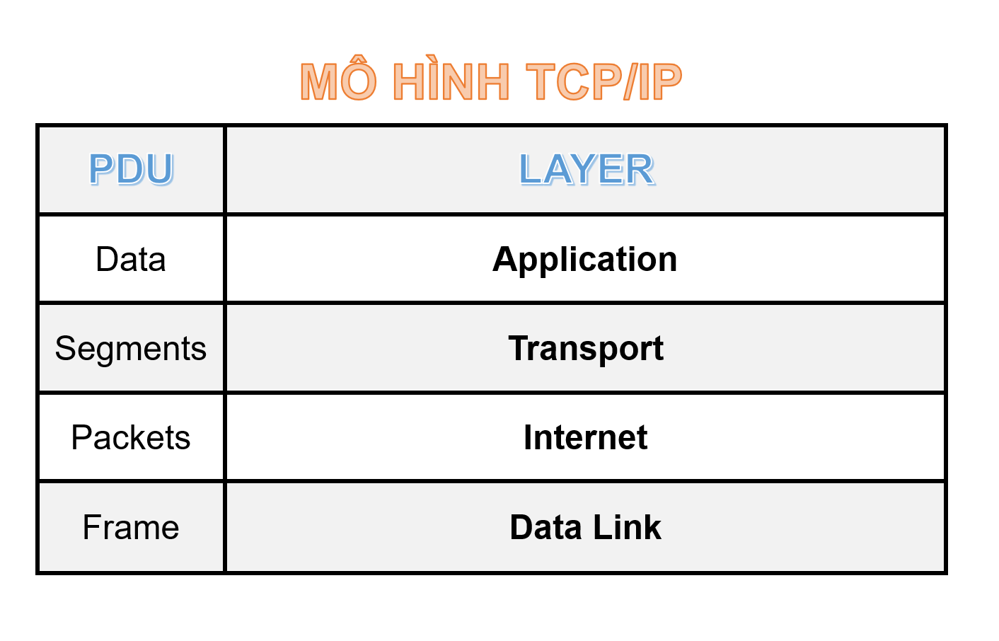

# Mô hình TCP/IP

## Khái niệm

- Mô hình TCP/IP (Transmission Control Protocol/Internet Protocol) là một bộ các giao thức mạng được sử dụng để liên kết các thiết bị mạng trên Internet và các mạng cục bộ (LANs - Local Area Networks). 

- Mô hình này được phát triển trong những năm 1970 và 1980 bởi DARPA (Defense Advanced Research Projects Agency) để trở thành một tiêu chuẩn mạng phổ biến. Mô hình TCP/IP bao gồm một loạt các giao thức và phân chia chúng thành các lớp khác nhau, mỗi lớp chịu trách nhiệm cho một phần cụ thể của quá trình truyền thông mạng.

- Dưới đây là mô tả của các lớp trong mô hình TCP/IP:

### Lớp ứng dụng (Application Layer)

- Lớp này là giao diện giữa ứng dụng và mạng. 

- Các giao thức trong lớp này cho phép ứng dụng gửi và nhận dữ liệu qua mạng. 

- Một số giao thức ứng dụng phổ biến bao gồm HTTP (HyperText Transfer Protocol), FTP (File Transfer Protocol), SMTP (Simple Mail Transfer Protocol), và DNS (Domain Name System).

### Lớp giao vận (Transport Layer)

- Lớp này cung cấp các dịch vụ truyền thông giữa các máy tính trên mạng. 

- Giao thức chính trong lớp này là TCP (Transmission Control Protocol) và UDP (User Datagram Protocol). 

- TCP cung cấp truyền thông tin cậy và đảm bảo độ tin cậy, trong khi UDP làm việc với truyền thông không đảm bảo độ tin cậy và ít phức tạp hơn.

### Lớp Internet (Internet Layer)

- Lớp này chịu trách nhiệm định tuyến và gửi gói dữ liệu giữa các mạng khác nhau. 

- Giao thức chính trong lớp này là IP (Internet Protocol). IP làm nhiệm vụ chia dữ liệu thành các gói và định tuyến chúng từ nguồn đến đích thông qua các mạng trung gian.

### Lớp liên kết dữ liệu (Link Layer) 

- Lớp này điều khiển truy cập vào môi trường truyền dẫn vật lý, như Ethernet hay Wi-Fi, và quản lý truyền dữ liệu giữa các nút trên cùng một mạng vật lý. 

- Địa chỉ MAC (Media Access Control) là một phần quan trọng trong lớp này, giúp xác định các thiết bị cụ thể trên mạng.

==> Mô hình TCP/IP cung cấp một cơ sở cho việc phát triển và triển khai các ứng dụng và dịch vụ mạng trên Internet và mạng cục bộ. Đồng thời, nó cũng cung cấp một cách hiệu quả để giao tiếp giữa các thiết bị và hệ thống từ các nhà cung cấp khác nhau.